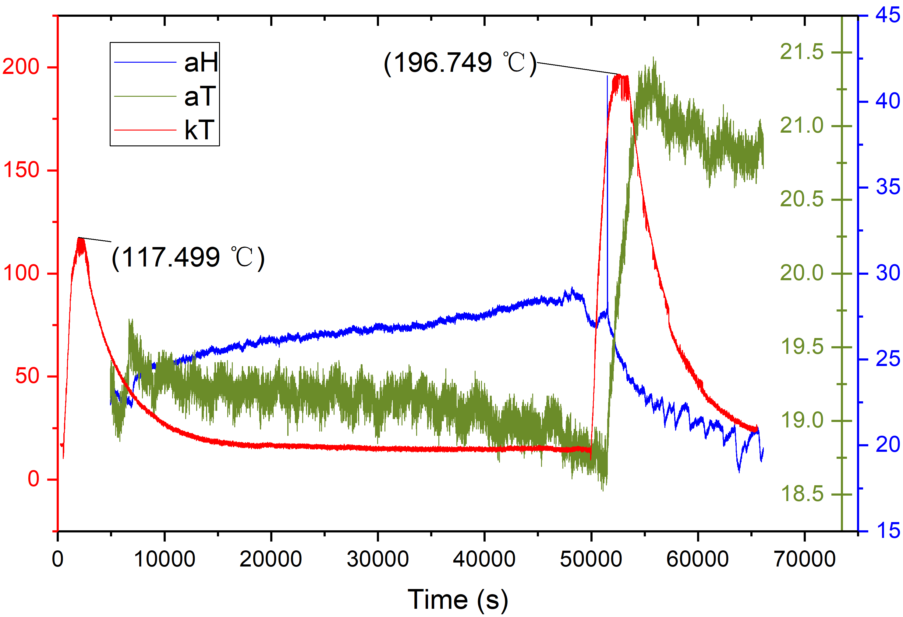

# LabWeb 项目之—— mqtt_esp 介绍
ESP8266 with K Thermocouple 、SHT20/30 、RTC DS3231 & MQTT @ 1Hz
ESP8266端精密1Hz采样的MQTT热电偶温度、环境温湿度实时采集

1. 使用了 mosca （node.js运行的MQTT Server），目前请把本项目只应用在受路由器隔离保护的局域网端口，也顺便省去了测试umqtt模块应用ssl证书代码运行情况的时间：https://github.com/micropython/micropython-lib 

2. esp8266只发送数据，不接受网络用户数据，也没有设置mqtt的订阅用户名、密码，并且请仅用受路由器隔离保护的局域网端口！！

外网访问：可再配置一个mqtt转发服务器，添加用户订阅权限以及密码控制，并一定要通过SSL/TLS加密开放端口来访问

3. （电脑 或 树莓派）Python记录数据使用paho-mqtt、pytables (HDF5) 模块。

## 目前测试结果：

## 要求：较强的Wifi网络或局域网环境；配置好wifi名称和密码；配置好MQTT Server与其IP地址（局域网）。

## 使用：按要求修改配置好；esp8266的Pin(13)接地，RST按键后不自动运行，方便调试, 之后上传min_esp文件夹内文件到esp8266模块（micropython >= 1.9.3）； 最后Pin(13）空接或接VCC（+3.3V），让my_app.py运行。

Wifi environment can not be weak ！

v1.0.0.beta 很好地运行，已满足超长期实验测量需求（2^32 - 65556 seconds），一定时间内断网可自动恢复，FIFO缓冲队列未太满情况下，数据采集不受影响；

Version v1.0.0.beta can run steadily for long-long time experiment. The network disconnection can be automatically resumed within a certain period of time. The data acquisition is not affected when the FIFO buffer queue is not too full.



## 版本历史：

### v0.9.8
每12小时，跳出循环，重启一下。

### v0.9.7

很好地运行，并且电脑服务器端的Python可自动订阅新esp客户端的每次ESP_init运行时间（UTC/GMT）、自动订阅每个esp8266的采集数据"DATA_topic"，并长期记录到HDF5中。

Flash按钮3秒种，可以暂停/恢复主循环，暂停时如果FIFO缓冲未满，数据采集帧数不受影响。

    每秒发送的数据如下：（json）

[{"id":10017,"kT":20.000000,"aT":18.591203,"aH":28.007935}]

"DATA_topic"由MAC地址自动生成，理论上每个esp8266都不一样，请参考程序。

Example log:
Runing... 2017-12-11 16:27:23

    初始化时，发送的数据如下：（json）

{"ESP_init":{
"DATA_topic":"data-esp-a6a8d500",
"DS3231 SetTime":"OK",
"NTP & RTC SyncTime":"OK",
"Time":"2017-12-11 08:24:07 GMT",
"Day_W":0,"Day_Y":345,
"DS3231 SQW":"1Hz Out Start0",
"ambient Temperature":"22.206819 ºC","ambient Humidity":"23.649957 %",
"Sensor SHT30":"OK",
"K Thermocouple":"24.250000 ºC",
"Sensor MAX6675":"OK"}}

jTime:2017-12-11 08:24:07 GMT,
jDATA_topic=data-esp-a6a8d500
ESP Time: 2017-12-11 16:24:07 @ Asia/Shanghai
esp_Timestamp = 1512951847

    目前测试发现之前版本int受限是RAM不够，所以：
    1. 先分配65555给 id, 主循环开始前减为0，希望保持占用的字节配额；
    2. 在主循环开始前，强制gc.collect()，回收RAM空间；
    3. my_app.py只要抛出异常，main.py强制machine.reset()重启；

### v0.9.6

v0.9.6 以后的版本把回调函数中的直接用的整数去除，概念上讲不受16bit int限制 。一定时间内断网可自动恢复，FIFO缓冲队列未太满情况下，数据采集不受影响。

Version 0.9.6 ， the callback function removed the integer, not subject to 16bit int restrictions conceptually.
The network disconnection can be automatically resumed within a certain period of time. The data acquisition is not affected when the FIFO buffer queue is not too full.

测试结果：发现还是收到16bit int限制，
但在Micropython交互界面测试，print整数可超过64 bit。
可能是umqtt.simple、内存的限制，也可能是交互界面的特殊提升int位数，
也许还是用v0.9.4方法，另外一个"thr"int——即"id"达到43200（12小时）后清零（"thr += 1"），再重复+1步进。


也可以加一个软件复位：
machine.reset()——
好处是：重启清空内存、初使化能同步NTP时间；
坏处是：交换界面反复输入reset()测试时，偶尔reset()不成功。


### v0.9.4

v0.9.4方法，用另外一个全局变量"thr"int补充记录——即"id"达到43200（12小时）后清零（"thr += 1"），再重复"id += 1"步进


## Defines & Pins - 
为了减少占用“内存”空间，程序中已移除几乎所有的空格、注释，
SHT20、SHT30、MAX6675、DS3231、MQTT、NTP等模块的库文件全部来自GitHub相关人员
（Under MIT License or BSD License），
特此感谢！

In order to reduce the occupation of "memory" space, the program has removed almost all the spaces, notes,
SHT20, SHT30, MAX6675, DS3231、MQTT、NTP module library files all come from GitHub's related personnel
(Under MIT License or BSD License)
Thanks!


### Wifi - boot.py
wlan.connect('', '') # ssid,password

### NTP - 网络校时 - ntptime_cn.py
host = "time.pool.aliyun.com"

### MQTT - 上传数据 (JSON 字符串格式)
```python
SERVER = "192.168.100.101"
CLIENT_ID = cl_id() # ds3231_time.py, b"esp-" + hexlify(unique_id())
TOPIC = b"esp001log"
DATA_TP = b"data-"+CLIENT_ID
```

### FIFO - 先入先出缓冲队列
i_data=[]
uheapq.heapify(i_data)
在触发采样程序和主循环程序间传递数据

### Pin(2) - IRQ 比较精确地触发采样
DS3231 SQW 1Hz TTL ---> Pin(2) IRQ DAQ
ESP8266自带的时间不是很准，
可用DS3231的可编程方波输出精密的1Hz信号，进而用上升沿/下降沿触发采样。

Micropython的irq触发回调函数写法目前比较特殊，
用micropython.schedule以及对象内部引用，避免在irq回调函数和
schedule函数中的一些限制（不能有浮点数......），可参考官方教程与例子后编写如下：

```python
class Foo():
    def __init__(self):
        self.push_ref = self.push
        p2 = Pin(2, Pin.IN)
        p2.irq(trigger=Pin.IRQ_RISING, handler=self.cb)
    def push(self, _):
        global i_pum,i_snd,i_data
        if -10 < (i_pum-i_snd) < 30:
            try:
                kT = sensor_k.measure() #MAX6675
                kTr = '%.3f' % (kT)
            except:
                kTr = 'null'
                pass
            try:
                aT, aH = sensor3.measure() #SHT30 / SHT20
                aTr = '%.3f' % (aT)
                aHr = '%.3f' % (aH)
            except:
                aTr = 'null'
                aHr = 'null'
                pass
            atemp ='[{"id":%d,"kT":%s,"aT":%s,"aH":%s}]' % (i_pum,kTr,aTr,aHr)
            uheapq.heappush(i_data,atemp)
            i_pum = i_pum + 1
        else:
            pass
    def cb(self, t):
        schedule(self.push_ref, 0)
```
### Pin(4),Pin(5) - I2C - DS3231时钟模块
i2c = I2C(scl=Pin(5), sda=Pin(4))
rtc = DS3231(i2c)

### Pin(4),Pin(5) - I2C - SHT30精密温湿度模块
scl_pin=5, sda_pin=4

### Pin(12),Pin(14),Pin(15) - SPI - MAX6675热电偶模块
```python
NUM_SPI = 1 # HSPI 硬件SPI，另外一个硬件SPI 0 被Flash占用
cs_pin=15, clk_freq=430000
_address = NUM_SPI
_cs = machine.Pin(cs_pin, machine.Pin.OUT)
_bus = machine.SPI(self._address, baudrate=clk_freq, polarity=0, phase=0)
```
### Pin(0) my_app.py while break
flash button
button = Pin(0, Pin.IN)
defaul button.value() == 1

### Pin(13) main.py run 接地，RST后不自动运行，方便调试
pin = Pin(13, Pin.IN, Pin.PULL_UP)
defaul pin.value() == 1

## ESP8266 Beginner入门

Official English Version is in http://docs.micropython.org/en/latest/esp8266/esp8266/tutorial/intro.html

**重要**
```
按下Flash按钮,然后RST按钮，过个3s先释放RST后再释放Flash按钮，这样deteched info区域就有信息，才能进入刷固件或擦除Flash模式，否则进入App模式
```


### 0、CP2102 usb转串口 驱动
 https://www.silabs.com/products/development-tools/software/usb-to-uart-bridge-vcp-drivers

### 1、插入usb接口。过了一会儿在windows的设备管理里面自动安装的一个串口设备（COM）,记住此串口编号。

### 2、更新固件。

本机上先安装ESPtool.py。这是一个用python开发的针对ESP8266的小工具，可以实现底层的操作。它也是一个开源项目，项目在github上进行托管：https://github.com/themadinventor/esptool

esptool是基于python2.7，所以安装esptool之前先安装python2.7。

用pip安装esptool：

2017/12/8 15:19 anaconda2 32bit esptool 2.1

  pip install esptool

因为esptool需要使用串口，所以还需要安装pyserial：

  pip install pyserial

### 3、烧录micropython固件

到官方网站http://www.micropython.org/download ，找到Firmware for ESP8266 boards，下载最新的固件，目前的是esp8266-20171101-v1.9.3.bin。

#### 可以先擦除：（现在版本提供的是exe,所以不用esptool.py --）
esptool --port /COM4 --baud 460800 erase_flash
或
esptool --port /COM4 --baud 115200 erase_flash

#### 进入下载固件的目录，烧录命令：

esptool --port /COM4 --baud 460800 write_flash --flash_size=detect 0 esp8266-20171101-v1.9.3.bin
或
esptool --port /COM4 --baud 115200 write_flash --flash_size=detect 0 esp8266-20171101-v1.9.3.bin

选择好后，点击“start”，后按下Flash按钮和RST按钮，过个3s先释放RST后再释放Flash按钮，这样deteched info区域就有信息，才能进入编程模式，否则进入App模式

For some boards with a particular FlashROM configuration (e.g. some variants of a NodeMCU board) you may need to use the following command to deploy the firmware (note the -fm dio option):
esptool  --port /COM4 --baud 115200 write_flash --flash_size=detect -fm dio 0 esp8266-20171101-v1.9.3.bin

### 4、上传.py

建议使用 https://github.com/BetaRavener/uPyLoader

注意python文件的格式：开头空格一定要统一, 防止文件编辑器自动改成了Tab，最好用Notepad++等检查.
